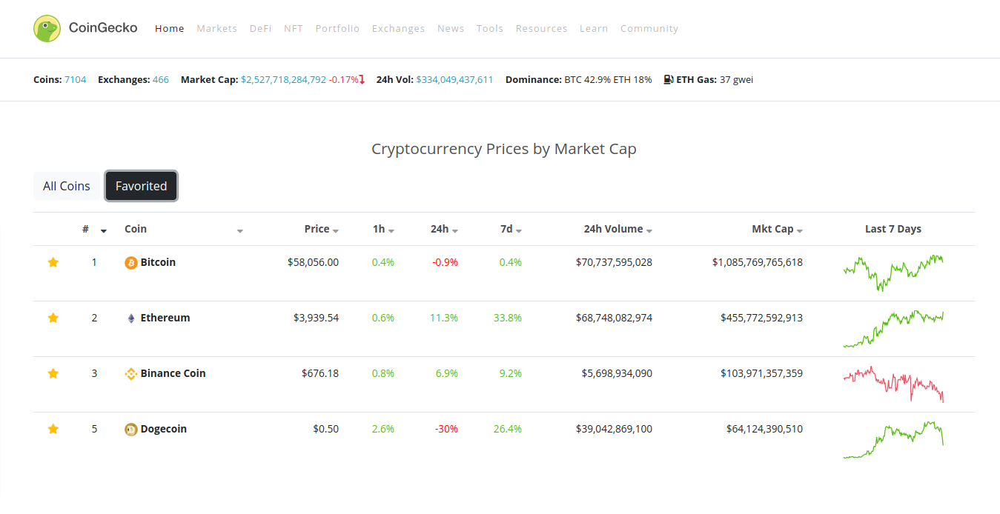
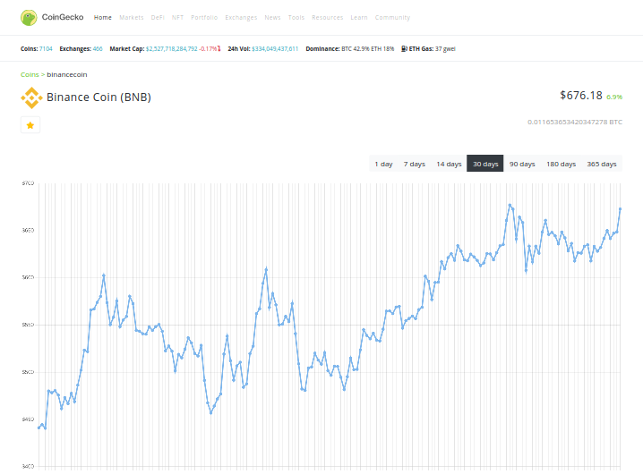

# Coingecko Clone

Cloned version of [coingecko](https://www.coingecko.com/en).

## Demo

[https://donztea-coingecko-clone.netlify.app](https://donztea-coingecko-clone.netlify.app)

## Highlighted User Interfaces

## How to run

> 1. install node.js
> 2. execute `npm install`
> 3. execute `npm audit fix`
> 4. execute `npm start`
> 5. now server application is running on http://localhost:3000
